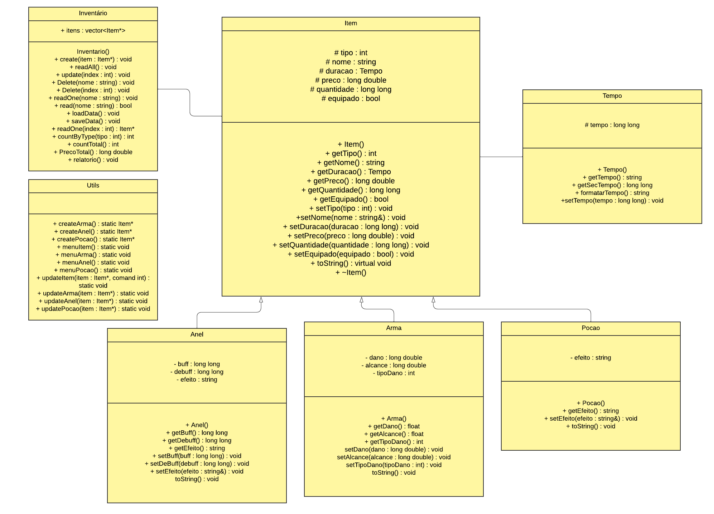

# ⚔️ Projeto CRUD - Inventário RPG

# 🧙🏻‍♂ Equipe

- 💍 [Alexandre Guedes](https://github.com/AlexandrxMK)
- 🗡️ [Arthur Maximus](https://github.com/Maximusthr)
- ⚗️ [Eliabe Rodrigues](https://github.com/EliabeRP)

# 🔮 Sobre o Projeto

Projeto desenvolvido para a disciplina de Linguagem de Programação I (LP I).
O mesmo consiste na criação de um sistema <b>CRUD</b>, composto de requisitos e especificações que atendam o projeto, tais como:
1. Diagrama de Classes
2. Possuir herança e poliforfismo
3. Conter composição
4. Gerar relatório das informações
5. Salvar os dados em arquivo

# 📜 Funcionalidades

O projeto possui 6 tipos de funcionalides, sendo elas:
1. Criação de itens
2. Leitura de um item individual
3. Leitura de todos os itens
4. Atualização dos itens, podendo ser qualquer tipo de atributo
5. Relatório do Inventário
6. Saída do programa

# 🏹 Instalação

A instalação do <b>Inventário RPG</b> é extremamente simples:

1. Clone o repositório (ou faça a instalação do arquivo ZIP):
  ```sh
  git clone https://github.com/AlexandrxMK/RPG-inventory.git
  ```
2. Comando de compilação _(utilizando g++)_:
  ```sh
  g++ -Iheaders -o rpg main.cpp classes/*.cpp utils.cpp
  ```
3. Para rodar o código:
  > O passo a seguir é apenas para Windows.
  ```sh
  ./rpg.exe
  ```
  > O passo a seguir é apenas para Linux.
  ```
  ./rpg.out
  ```

# ☄️ Diagrama de Classes


